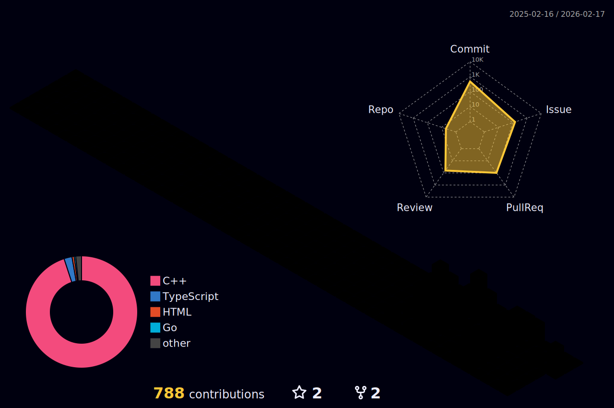

  <h1>Hi there 👋, I'm Raphaël Chanliongco</h1>
  <picture>
    <source media="(prefers-color-scheme: dark)" srcset="profile-3d-contrib/profile-night-rainbow.svg">
    <source media="(prefers-color-scheme: light)" srcset="profile-3d-contrib/profile-night-rainbow.svg">
    
  </picture>
  
   
  
  <picture>
    <source media="(prefers-color-scheme: dark)" srcset="output/github-contribution-grid-snake-dark.svg">
    <source media="(prefers-color-scheme: light)" srcset="output/github-contribution-grid-snake.svg">
    
  </picture>

<!--
**raprapchh/raprapchh** is a ✨ _special_ ✨ repository because its `README.md` (this file) appears on your GitHub profile.

Here are some ideas to get you started:

- 🔭 I’m currently working on ...
- 🌱 I’m currently learning ...
- 👯 I’m looking to collaborate on ...
- 🤔 I’m looking for help with ...
- 💬 Ask me about ...
- 📫 How to reach me: ...
- 😄 Pronouns: ...
- ⚡ Fun fact: ...
-->
